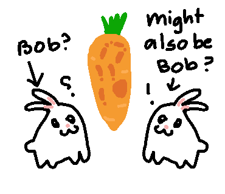

# Bunnies

Alice has a pet bunny, named Bob. One day, Bob went missing!

Alice, before searching far and wide, internalizes the fact that *she is a powerful witch, who can cast powerful spells*. After a wave of her wand, Bob's memory fresh in her mind, she summons a bunny! ... or two? Being the bunny-lover that she is, she would rather keep both the bunnies. Of course, she wants to differentiate between the two. 

Conveniently, she knows that Bob gnaws on carrots in a very specific way—just like how she eats the sandwich crust first before digging into its good bits. Given a string $s$ of length $2n$, with each half representing the bunny's chewing pattern on the carrot, kindly find the half that matches exactly to what Alice remembers.

  

Note: Being the powerful witch that she is, Alice guarantees that Bob is either of the bunnies. In other words, given the string $t$ that Bob would chew a carrot, $t$ would be a substring of $s$. Oh, and, Alice will name the other bunny Ben.

## Input

The first line of input contains $n$.

The second line of input is the string $s$ of length $2n$.

The third line of input is the string $t$ of length $n$.

### Constraints

${1\leq n\leq 100}$

$s$ and $t$ consist of lowercase English characters.

## Output

Output a single line, stating `LEFT` or `RIGHT`. This should correspond to the half that reflects Bob's chewing pattern.
